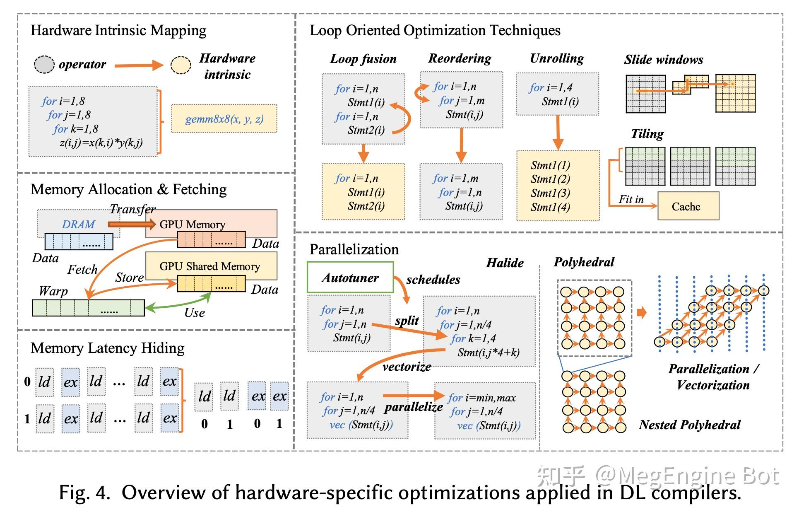

# 模型部署和加速

## 训练

### 训练框架

[Genann](https://github.com/codeplea/genann): c语言的ANN训练框架开发教程(示例)

[图解大模型训练系列之：DeepSpeed-Megatron MoE并行训练（原理篇）](https://mp.weixin.qq.com/s/fdou9rDt8GMGT0aki-6K9A): 分析Deepspeed在MoE 大模型训练时候的设计思路

[Machine Learning Engineering Open Book](https://github.com/stas00/ml-engineering/blob/master/README.md): 正在更新的图书,可以熟悉LLM及软硬件的相关知识

[MACHINE LEARNING SYSTEMS with TinyML](https://github.com/harvard-edge/cs249r_book): 图书

#### [Deepspeed](https://github.com/microsoft/DeepSpeed)

[DeepSpeed Chat: 一键式RLHF训练，让你的类ChatGPT千亿大模型提速省钱15倍](https://aijishu.com/a/1060000000397639)
* Deepspeed框架的[Chat模型训练实例](https://github.com/microsoft/DeepSpeedExamples/tree/master/applications/DeepSpeed-Chat).

[一文详解解 DeepSpeed](https://mp.weixin.qq.com/s/NYHTsxZZ7-DN7rfYPjTogQ?v_p=90&WBAPIAnalysisOriUICodes=10000001&wm=3333_2001&aid=01A2GUVvCiJ0bN45VH0AOVftc20OVPaYUZmVa1h1s_8-8xrdg.&from=10D5193010)

[一键式 RLHF 训练 DeepSpeed Chat（一）：理论篇](https://mp.weixin.qq.com/s/t5lT1NIZ6TysfgJks7kYKA?v_p=90&WBAPIAnalysisOriUICodes=10000001&wm=3333_2001&aid=01A2GUVvCiJ0bN45VH0AOVftc20OVPaYUZmVa1h1s_8-8xrdg.&from=10D5193010)

[DeepSpeed Inference: Enabling Efficient Inference of Transformer Models at Unprecedented Scale](https://arxiv.org/abs/2207.00032)

[DeepSpeed Compression: A composable library for extreme compression and zero-cost quantization](https://www.microsoft.com/en-us/research/blog/deepspeed-compression-a-composable-library-for-extreme-compression-and-zero-cost-quantization/)

[NLP大规模语言模型微调实践：DeepSpeed+Transformers实现简单快捷上手百亿参数模型微调](https://mp.weixin.qq.com/s/thlnokFT495NMOzC08FInw)

[人手一个 ChatGPT，微软 DeepSpeed Chat 震撼发布，一键 RLHF 训练千亿级大模型](https://www.ithome.com/0/686/048.htm)

[DeepSpeed-Chat：最强ChatGPT训练框架，一键完成RLHF训练！](https://mp.weixin.qq.com/s/CCFpr9rfpFmwHFLB29KGCg)

[使用DeepSpeed/P-Tuning v2对ChatGLM-6B进行微调](https://mp.weixin.qq.com/s/5Zx3I39cPzfWt-HN_e-jFw)

[ChatGLM_multi_gpu_zero_Tuning](https://github.com/CSHaitao/ChatGLM_mutli_gpu_tuning)

[【DeepSpeed 教程翻译】二，Megatron-LM GPT2，Zero 和 ZeRO-Offload](https://mp.weixin.qq.com/s/UO7bLghblw-uoErSnnQyEQ)

[【DeepSpeed 教程翻译】开始，安装细节和CIFAR-10 Tutorial](https://mp.weixin.qq.com/s/xpNQtl7hPs3fy9S7VRbIkg)

[DeepSpeed结合Megatron-LM训练GPT2模型笔记（上）](https://mp.weixin.qq.com/s?__biz=MzA4MjY4NTk0NQ==&mid=2247509973&idx=1&sn=556bdac8e4d35ae44e426e3032525fd8&chksm=9f831d43a8f49455d53b36220088baeccdba661b68d0ae9fa86b64e8025554d7bfb19537b599&scene=178&cur_album_id=2961704839032373253#rd)

[如何使用 Ray + DeepSpeed + HuggingFace 简单、快速、高效、高性价比地微调和部署大型语言模型](https://mp.weixin.qq.com/s/oJVTnStufXheobXvpVB8cQ)

[DeepSpeed ZeRO++: A leap in speed for LLM and chat model training with 4X less communication](https://www.microsoft.com/en-us/research/blog/deepspeed-zero-a-leap-in-speed-for-llm-and-chat-model-training-with-4x-less-communication/)
* chatgpt减少通信量方法

### Megatron

[图解大模型训练之：Megatron源码解读2，模型并行](https://mp.weixin.qq.com/s/KAW1DD8P0Q1Ljsacs8r3rQ)

### 数据并行

[HPC、RDMA资料分享：2023 OpenFabrics Alliance会议](https://mp.weixin.qq.com/s/HrAl9E6Xn8YA9eP-f_sZKw)
* RDMA资料,见[百度网盘, 解压密码: ofa2023](https://pan.baidu.com/s/1tiFurQmcK3uhZH331b7bSA?pwd=8wye)

### 模型并行

### 流水并行

### 调优方法

[深度学习调优指南中文版](https://github.com/schrodingercatss/tuning_playbook_zh_cn)
* 谷歌深度学习调优手册中文翻译

[绕开算力限制，如何用单GPU微调 LLM？这是一份「梯度累积」算法教程](https://mp.weixin.qq.com/s/hZIFDzBQ9TGTST1lFUouEw)

[LLaMA-Efficient-Tuning](https://github.com/hiyouga/LLaMA-Efficient-Tuning)
* LLaMA高效调优库

[Finetuning Falcon LLMs More Efficiently With LoRA and Adapters](https://sebastianraschka.com/blog/2023/falcon-finetuning.html)

## 推理

### 推理框架

[TT-Buda](https://github.com/tenstorrent/tt-buda): tenstorrent硬件的AI编译工具

[Text Generation Inference源码解读（二）：模型加载与推理](https://mp.weixin.qq.com/s/Plcp3tIXhQE1pXgM9C9JSg): TGI优化方法总结和新量化推理方法添加

[JittorLLMs](https://github.com/Jittor/JittorLLMs)
* 清华大模型推理库, 最低2G内存,支持chatGLM/盘古/chatRWKV/LLaMA,只需安装JTorch,提升速度

[FlyCV](https://github.com/PaddlePaddle/FlyCV)
* OpenCV竞品, 高性能计算机图像系统, 支持C++/JS,针对ARM优化,支持多种异构硬件

[fastllm](https://github.com/ztxz16/fastllm)
* llm加速库,支持moss/chatGLM,baichuan,支持手机端和GPU(int8)

[Merge Large Language Models with mergekit](https://towardsdatascience.com/merge-large-language-models-with-mergekit-2118fb392b54): 四种模型融合方法, SLERP、TIES、DARE和级联

[FlagPerf](https://github.com/FlagOpen/FlagPerf): 智源开源的异构AI芯片测评框架

[jan](https://github.com/janhq/jan): 本地大模型运行软件, 可替代chatgpt

### 量化

[Accelerating Large Language Models with Mixed-Precision Techniques](https://sebastianraschka.com/blog/2023/llm-mixed-precision-copy.html)

### 剪枝

### 蒸馏

[ChatLLM.cpp](https://github.com/foldl/chatllm.cpp): 基于ggml的C++大模型CPU推理引擎
## 深度学习编译器

[如何开发编译器?](https://www.zhihu.com/question/28862935/answer/3049912195)
* 旷视编译器介绍
* 编译器最重要的两个概念是IR和PASS
* 前端优化方法
  * node level:去掉无用节点,替换搞笑节点
  * block level:代数简化,算子融合
  * dataflow level:静态内存优化
* 后端优化(见下图)
  * 通用优化:循环展开/循环融合/访存掩盖
  * 硬件优化:指令映射(gemm)/向量化(循环)/手工kernel
* MEGCC编译过程
  * Megengine导入模型并静态图优化
  * 转换为MLIR的MGB IR
  * 生成Abstract Kernel IR,最终转换成Kernel IR
  * 导出为runtime model和runtime kernel

[TVM北京交流会](https://aijishu.com/a/1060000000409104)
* 后续PPT有时间可以整理一些

[Clang前端使用LLVM Pass示例](https://www.cnblogs.com/wujianming-110117/p/17426917.html)
* 原博客在[微信公众号](https://mp.weixin.qq.com/s/e3e4a7ei61O99-JUWjDbnA)

[（十八）使用 DLA](https://zhuanlan.zhihu.com/p/552537009?utm_id=0)
* cuDLA是加速引擎库

[学习wgpu](https://jinleili.github.io/learn-wgpu-zh/)
* webgpu教材翻译,在网页内访问GPU

[Automated GPU Kernel Fusion with XLA](https://llvm.org/devmtg/2019-04/slides/TechTalk-Joerg-Automated_GPU_Kernel_Fusion_with_XLA.pdf): XLA融合介绍

[Intel(R) Extension for Scikit-learn*](https://github.com/intel/scikit-learn-intelex): Intel Extension, import然后执行替换的方式很不错

[Intel 文档中心](https://www.intel.com/content/www/us/en/developer/tools/documentation.html)

[torchquad@github](https://github.com/esa/torchquad):PyTorch实现的GPU任意维高性能数值积

[编译器优化那些事儿（12）：LLVM 自动向量化](https://mp.weixin.qq.com/s/O6spKbznq9bAQTqZkq7vXA): 向量化

[Text Generation Inference](https://github.com/huggingface/text-generation-inference): huggingface的推理引擎

## Tools

[Search with Lepton](https://github.com/leptonai/search_with_lepton/tree/main): 实现的一个对话式搜索引擎, 试用在[这里](https://search.lepton.run/)